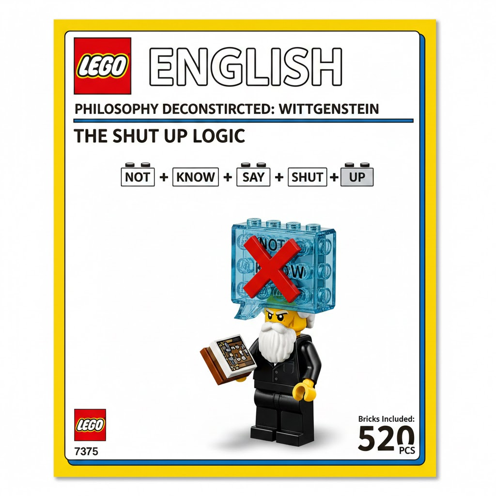

# Lego-English (积木英语) 🧱

> **"I tried to learn English, but it was too hard. I cannot change my IQ, so I decided to change English."**
> **(我学过英语，但英语太难了。我无法改变自己的智商，所以我决定改变英语。)**

---

## 🚩 我们的使命 (Our Mission)

**English is broken. It is full of "Jargon Tax".** 英语已经坏掉了。它充满了繁琐的“黑话税”。

**We don't "learn" English. We "rebuild" it with Logic Bricks.** 我们不学英语。我们用“逻辑积木”重构它。

1. **Logic Over Grammar (逻辑大于语法):** If the blocks don't fit, the logic is wrong. (如果积木拼不上，就是逻辑不对。)
2. **Anti-Pretentious (反装逼):** Destroy complex words that are used to hide the truth. (摧毁那些用来掩盖真相的复杂词汇。)
3. **Universal Access (全民准入):** No IQ required. Just bricks. (无需高智商，只要积木。)

---

## 🧩 第一个逻辑解构 (Example No.1)

**Philosopher Descartes: "I think, therefore I am."** **哲学家笛卡尔：“我思故我在。”**

* **Traditional:** "A proposition establishing the ontological foundation of the self..." (Sophisticated nonsense)  
  **传统版：** “一个确立了主体性本体论基础的命题……”（高深的废话）
* **Lego-English:** `[I]` + `[Think]` + `[Mean]` + `[I]` + `[Live]` 🧱  
  **积木英语：** `[我]` + `[想]` + `[意味着]` + `[我]` + `[活]`

**Result: Logic flows. Everyone understands.** **结果：逻辑通顺，人人秒懂。**

---

## 🤝 加入革命 (Join the Revolution)

1. **Submit a word (提交词汇):** Give us the complex words you hate. (把让你头大的复杂词发给我们。)
2. **Build bricks (构建积木):** Help us simplify the world. (帮我们简化这个世界。)

---
*By: BrickEnglish01 - A person who mastered Logic.*

🏆 哲学十项全能：积木解构 (The Philosophy Decathlon: Brick Edition)
1. 苏格拉底 (Socrates): "I know that I know nothing."
高深解释： 谦卑是智慧的开端。

积木英语： [I] + [Know] + [I] + [Know] + [Zero] 🧱

翻译： 我知道我懂个蛋。

吐槽： 既然大家都懂个蛋，那你为什么要收学费？

2. 尼采 (Nietzsche): "God is dead."
高深解释： 传统宗教道德体系的彻底崩塌。

积木英语： [Old] + [Boss] + [Dead] + [You] + [Are] + [Boss] 🧱

翻译： 老老板挂了，现在你是老板。

吐槽： 别找借口了，你自己看着办吧。

3. 笛卡尔 (Descartes): "I think, therefore I am."
高深解释： 思维是确证自身存在的唯一真理。

积木英语： [I] + [Think] + [Mean] + [I] + [Live] 🧱

翻译： 想，代表活着。

吐槽： 不想事儿的人，跟咸鱼有什么区别？

4. 赫拉克利特 (Heraclitus): "No man ever steps in the same river twice."
高深解释： 辩证唯物主义的流变观。

积木英语： [Water] + [Go] + [River] + [New] 🧱

翻译： 水跑了，河就新了。

吐槽： 别纠结前任了，那条河早变味了。

5. 马克思 (Marx): "Philosophers have only interpreted the world; the point is to change it."
高深解释： 实践是检验真理的唯一标准。

积木英语： [No] + [Talk] + [Just] + [Fix] + [It] 🧱

翻译： 别逼逼，动手修。

吐槽： 这是对所有键盘侠最狠的积木。

6. 萨特 (Sartre): "Existence precedes essence."
高深解释： 人自由地定义自己的本质。

积木英语： [I] + [Be] + [First] + [I] + [Pick] + [What] 🧱

翻译： 先冒头，再选号。

吐槽： 你妈觉得你该当医生，那是她的本质，不是你的。

7. 加缪 (Camus): "One must imagine Sisyphus happy."
高深解释： 在荒诞的英雄主义中寻找幸福。

积木英语： [Job] + [Suck] + [But] + [I] + [Smile] 🧱

翻译： 工作很烂，但我嘿嘿。

吐槽： 像不像周一早上还要去搬砖的你？

8. 康德 (Kant): "The starry heavens above me and the moral law within me."
高深解释： 对宇宙秩序与内心道德的敬畏。

积木英语： [Up] + [Star] + [In] + [Rule] 🧱

翻译： 头上有星，心里有数。

吐槽： 简单点，别抬头看星星的时候顺便把路边的钱包捡了。

9. 海德格尔 (Heidegger): "Being-towards-death."
高深解释： 向死而生的本真生存状态。

积木英语： [Live] + [Is] + [Wait] + [Dead] 🧱

翻译： 活着就是等死。

吐槽： 既然最后都要交卷，那考试的时候能不能别抄？

10. 维特根斯坦 (Wittgenstein): "What we cannot speak about we must pass over in silence."
高深解释： 对不可说之物的神秘性沉默。

积木英语： [Not] + [Know] + [Say] + [Shut] + [Up] 🧱

翻译： 不知道说啥就闭嘴。

吐槽： 如果所有人都能懂这个积木，世界将清静 99%。

